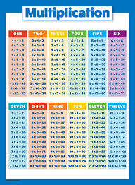

# TableMultiplicat

Une table de multiplication affiche dans les lignes et colonnes le résultat de la multiplication

- This plugin is an add-on for the [A.V.A.T.A.R](https://avatar-home-automation.github.io/docs) framework. 

 ## 🎯 Usage
Commandes :
- quel est la table de multiplication de 1,2, 3, 4, 5 ....
- les chiffres de 1-100

## Multi-room

The `TableMultiplicat` plugin is fully multi-room.

## Multi-language

The `TableMultiplicat` plugin relies solely on the system's available languages.

 <table style="border: none;">
  <tr>
    <td style="border: none;"></td>
    <td style="border: none;">
      <h1 style="margin: 0;color: brown;">TableMultiplicat</h1>
      <h3 style="margin: 0;">Get Multiplication table</h3>
    </td>
  </tr>
</table>
